# Cloud SOC Lab — Threat Detection & Incident Response using Wazuh SIEM on AWS

## Project Overview

Built a fully functional cloud-based Security Operations Center (SOC) lab on AWS to simulate real-world cyber attacks and detect them using Wazuh SIEM. This project demonstrates hands-on experience with threat detection, incident response, and compliance monitoring in a hybrid cloud environment.

## Architecture

```
Local Mac (UTM)
├── Kali Linux VM (192.168.64.3)     — Attacker machine
└── Windows 11 VM (192.168.64.10)    — Victim machine with Wazuh Agent

AWS Cloud
└── Ubuntu EC2 t3.medium (us-east-2)
    ├── Wazuh Manager     — Receives and analyzes logs
    ├── Wazuh Dashboard   — Visualizes alerts
    ├── CloudTrail        — AWS API monitoring
    └── GuardDuty         — Cloud threat detection
```

## Tools & Technologies

- **SIEM:** Wazuh 4.7.5
- **Cloud:** AWS EC2 (Ubuntu, us-east-2 / Ohio)
- **Attack Machine:** Kali Linux (UTM on Apple Silicon)
- **Victim Machine:** Windows 11 Pro (UTM on Apple Silicon)
- **Attack Tools:** Nmap, Hydra, CrackMapExec

## Attack Simulations

### 1. Network Reconnaissance (Nmap)

- **Tool:** Nmap 7.98
- **Command:** `nmap -sV -sC 192.168.64.10`
- **Finding:** Discovered open ports 135 (msrpc), 139 (netbios-ssn), 445 (microsoft-ds/SMB). Hostname fingerprinted as `WIN-B4NBUJUI7M6`. SMB signing enabled and required.
- **MITRE ATT&CK:** T1046 — Network Service Discovery
- **Wazuh Detection:** Security events generated and logged

### 2. SSH Brute Force (Hydra)

- **Tool:** Hydra
- **Command:** `hydra -l administrator -P rockyou.txt 192.168.64.10 ssh`
- **Finding:** 20 authentication failure alerts generated (rule 60122, level 5)
- **MITRE ATT&CK:** T1110 — Brute Force
- **Wazuh Detection:** Authentication failure alerts triggered in real time

### 3. SMB Lateral Movement (CrackMapExec)

- **Tool:** CrackMapExec
- **Finding:** Successfully fingerprinted target — Windows 11, SMB signing enabled and required
- **MITRE ATT&CK:** T1021 — Remote Services
- **Result:** Windows Firewall blocked connections — documented as expected defensive behavior

## Detections & Compliance Mapping

Every alert was automatically mapped to multiple compliance frameworks by Wazuh:

| Framework | Control |
|---|---|
| NIST 800-53 | AC.7, AU.14 |
| GDPR | IV_32.2 |
| HIPAA | 164.312.b |
| PCI-DSS | 10.2.5 |
| TSC | CC6.8, CC7.2, CC7.3 |

## Key Findings

- **599 total security events** detected across the lab environment
- **20 authentication failures** from SSH brute force attack (rule 60122)
- **52 authentication successes** logged and mapped to T1078 (Valid Accounts)
- **MITRE ATT&CK techniques detected:** Defense Evasion, Privilege Escalation, Persistence, Initial Access, Impact, Credential Access, Lateral Movement, Brute Force
- **Top technique:** T1078 — Valid Accounts (dominant across both agents)
- All attacks detected and logged in real time with full forensic detail

## Screenshots

| Screenshot | Description |
|---|---|
| 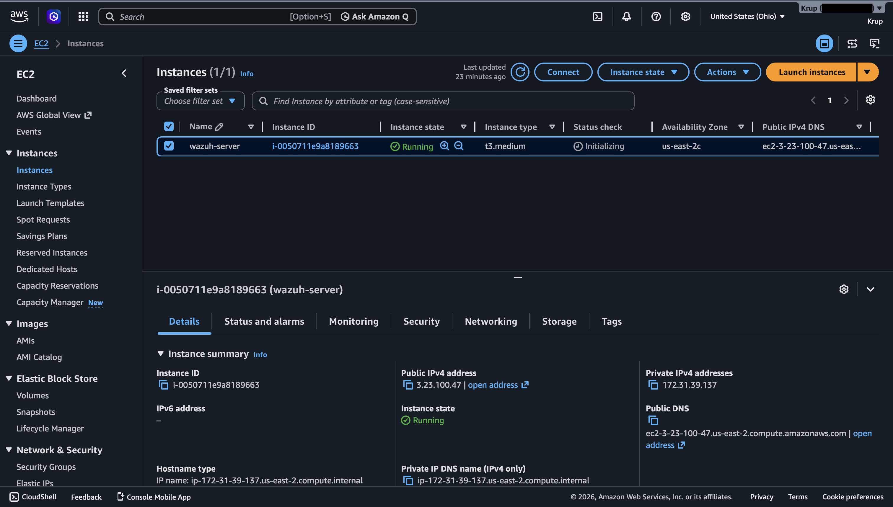 | AWS EC2 instance (`i-0050711e9a8189663`) running in us-east-2, public IP 3.23.100.47 |
| 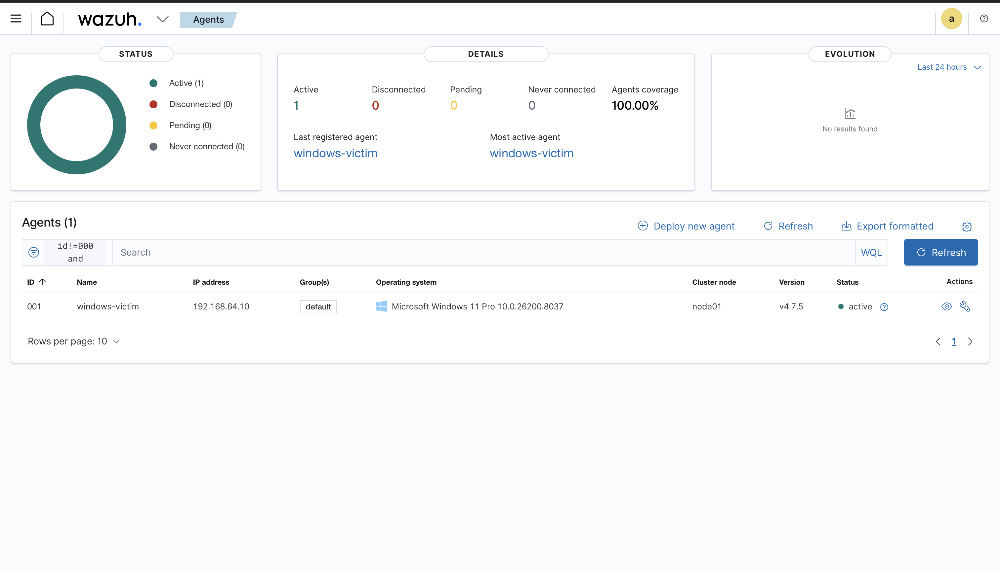 | Windows 11 Pro agent (`windows-victim`, 192.168.64.10) connected and active — 100% agent coverage |
| 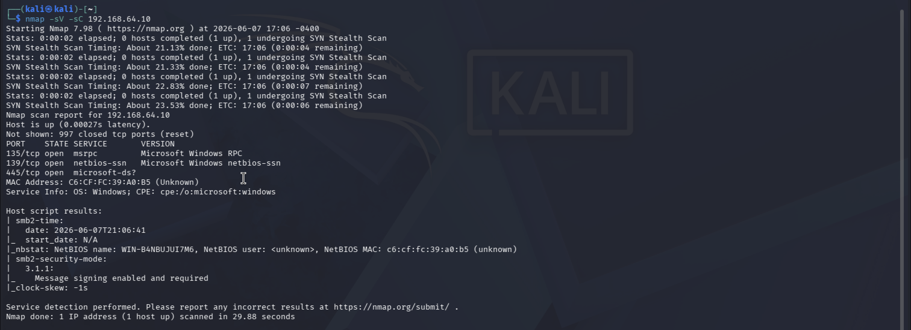 | Nmap scan output from Kali Linux — ports 135, 139, 445 discovered, OS fingerprinted as Windows |
|  | Security events dashboard showing 599 total alerts, 20 auth failures, 52 auth successes |
| 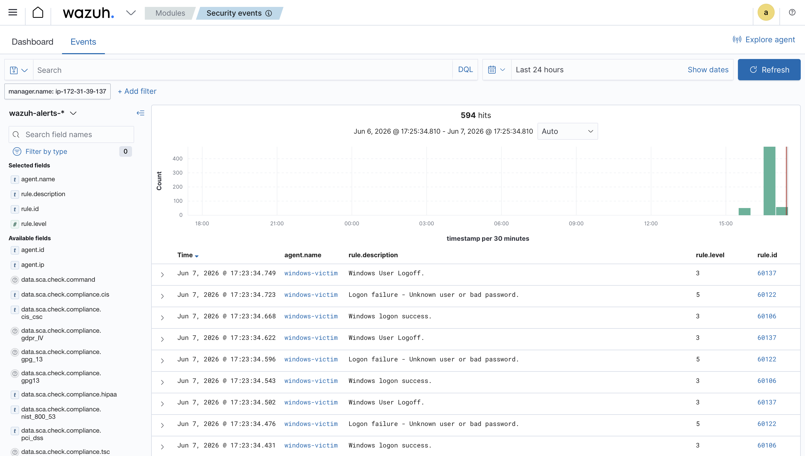 | MITRE ATT&CK security alerts table — T1078 technique mapped across multiple events |
| 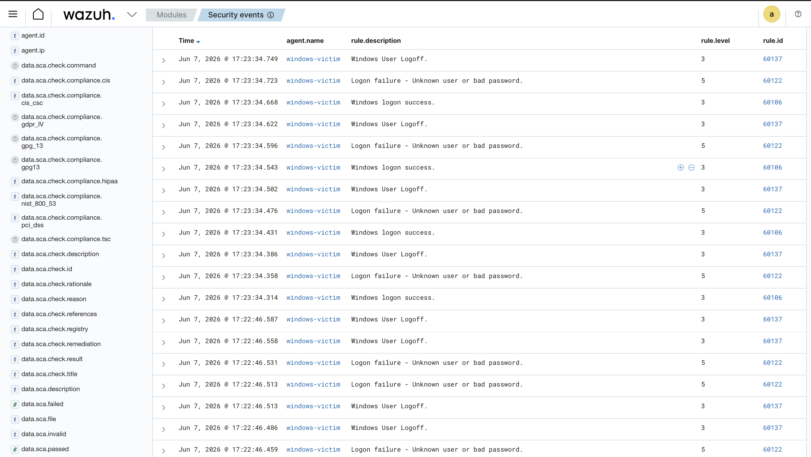 | Live event feed showing repeated logon failures (rule 60122, level 5) and logon successes from `windows-victim` |
| 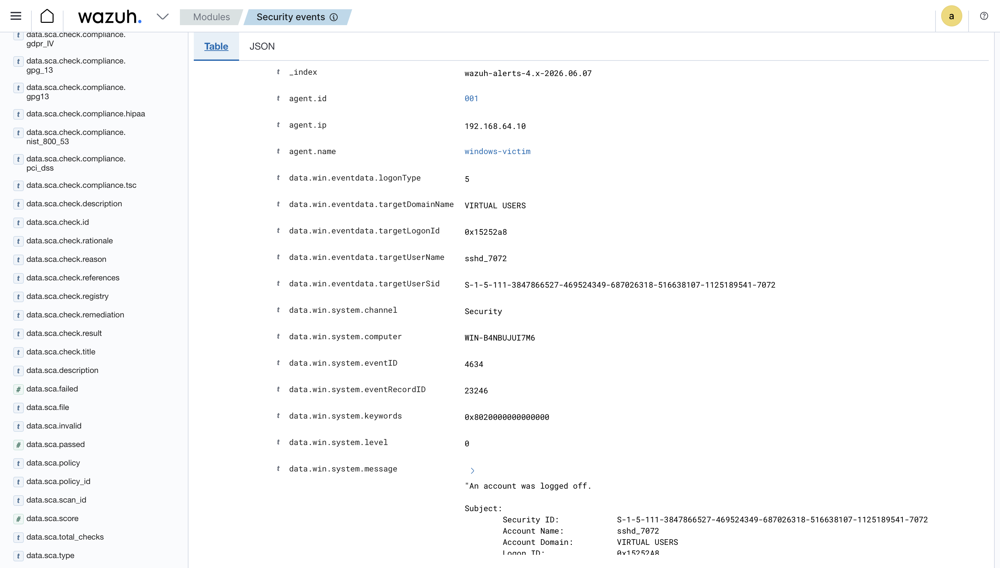 | Detailed forensic event view — agent IP, Windows Event ID 4634, compliance fields, timestamp |
| 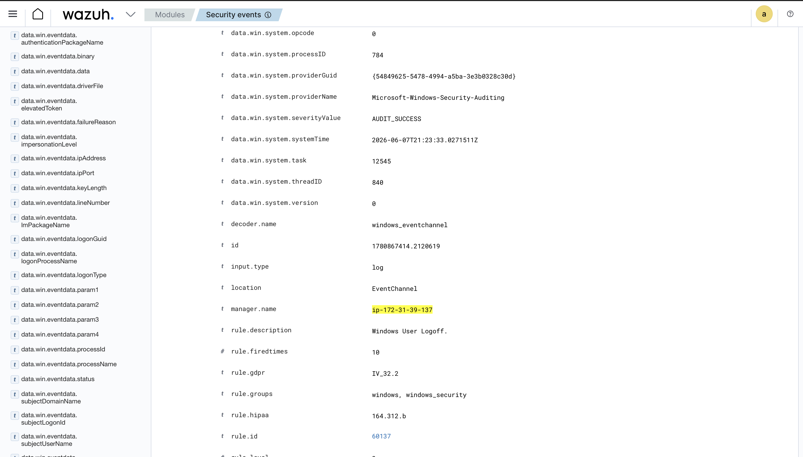 | Event detail showing full compliance mapping: GDPR IV_32.2, HIPAA 164.312.b, NIST AC.7/AU.14, PCI-DSS 10.2.5, TSC CC6.8/CC7.2/CC7.3 |
| 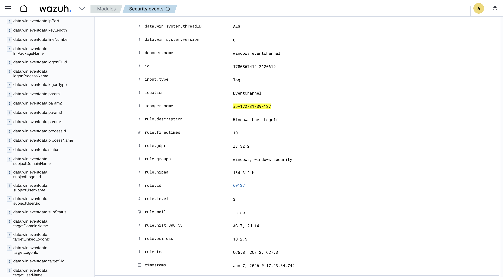 | Compliance frameworks view |
| 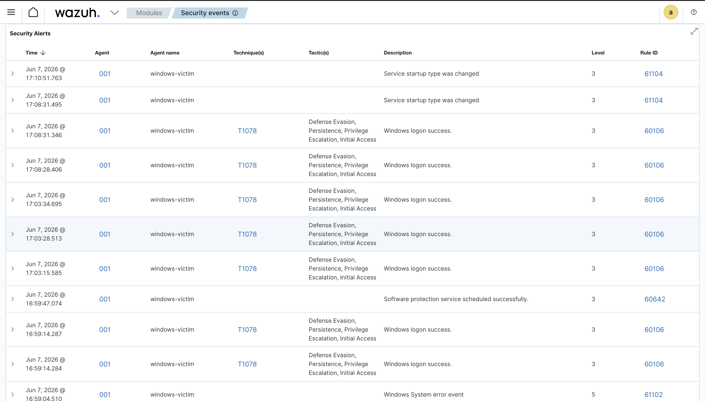 | Security events filtered to show 594 hits with alert level spike during attack window |
| 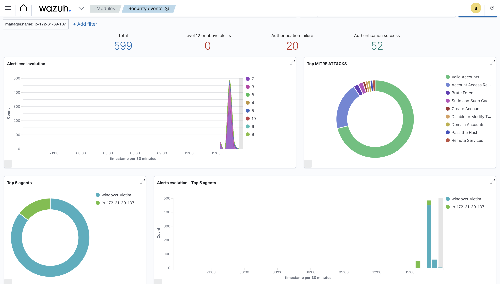 | Security events dashboard filtered to `windows-victim` agent with MITRE ATT&CK overview |
| 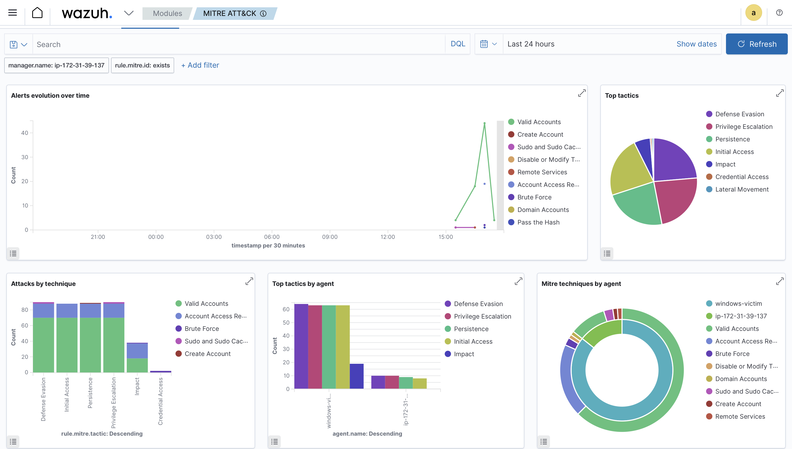 | Full MITRE ATT&CK dashboard — alerts over time, top tactics, attacks by technique, top tactics by agent |

## Author

Krup Patel — SOC Analyst
